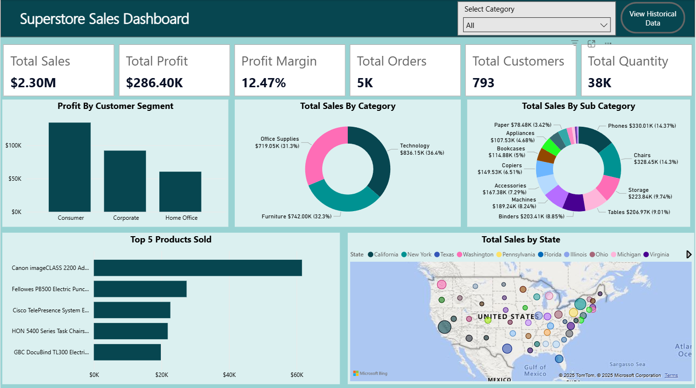
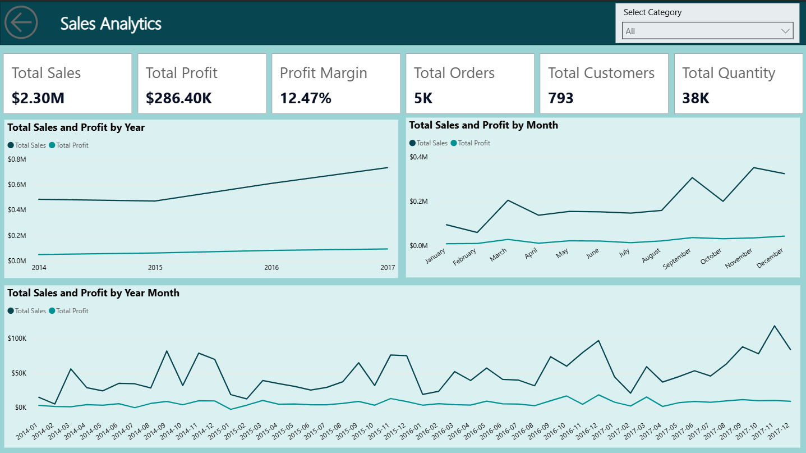
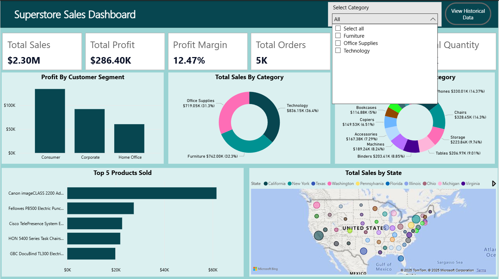
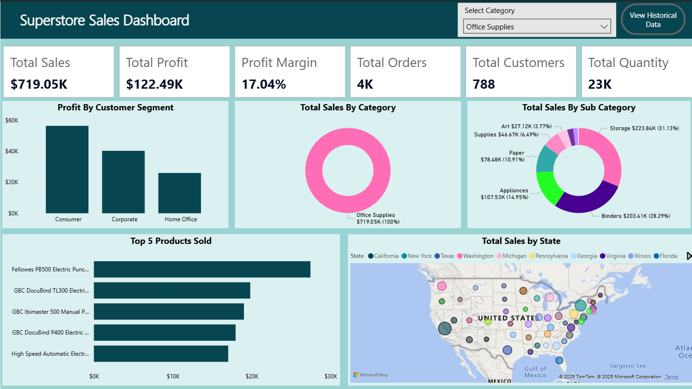
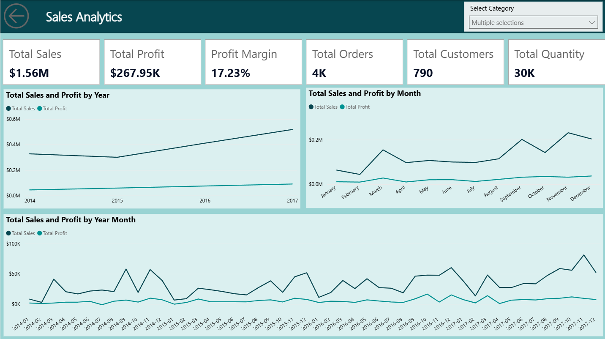

# Superstore Sales Dashboard

This repository contains a **Power BI dashboard** built for analyzing the Superstore dataset. The dashboard provides insights into sales performance, profit margins, order trends, customer segments, and product categories over time. It is designed to help businesses make data-driven decisions by visualizing key sales metrics.

---

## Dashboard Overview

The dashboard is divided into two main sections:

1. **Sales Analytics**
   - Shows total sales, total profit, profit margin, total orders, total customers, and total quantity.
   - Includes trend analyses for:
     - **Total Sales and Profit by Year**
     - **Total Sales and Profit by Month**
     - **Total Sales and Profit by Year-Month**
   - Interactive category filter allows viewing specific product categories and their performance.

2. **Superstore Sales Dashboard**
   - Provides detailed visualizations for business insights, including:
     - **Profit by Customer Segment**
     - **Total Sales by Category** (Furniture, Office Supplies, Technology)
     - **Total Sales by Sub-Category**
     - **Top 5 Products Sold**
     - **Total Sales by State** (map visualization)
   - Category dropdown allows filtering the dashboard by single or multiple categories.

---

## Key Features

- **Interactive Filters:** 
  - Filter data by product categories to view sales and profit trends for specific segments.
- **Trend Analysis:** 
  - Analyze sales and profit trends over time (yearly, monthly, and by month-year).
- **Customer Insights:** 
  - View profit contribution by customer segment (Consumer, Corporate, Home Office).
- **Geographic Insights:** 
  - Map visualization shows total sales by state for a quick geographic analysis.
- **Product Insights:** 
  - Identify top-selling products and their contribution to overall sales.

---

## Dashboard Screenshots

### 1. Main Superstore Dashboard

### 2. Main Sales Analytics

### 3. Category Selection Dropdown

### 4. Main Dashboard Filtered by Category

### 5. Sales Analytics Filtered by Category

---

## Dataset

- **Source:** Superstore Dataset (commonly used sample dataset for sales analysis)
- **Fields Used:** Sales, Profit, Quantity, Order Date, Customer Segment, Category, Sub-Category, State, Product Name, Order ID

---

## How to Use

1. Open the `Superstore Sales Dashboard.pbix` file in Power BI Desktop.
2. Use the **category dropdown** to filter data by one or more product categories.
3. Hover over charts to see detailed metrics and trends.
4. Analyze:
   - Total sales and profit trends
   - Customer segment contribution
   - Product and category performance
   - Geographic sales distribution

---

## Technologies Used

- **Power BI Desktop**
- **DAX** for calculated measures (Profit Margin, Total Orders, etc.)
- **Interactive Visualizations:** Line charts, bar charts, donut charts, map visuals, and slicers

---

## Author

**Arun Nivethan**  
Email: arunnivethan435@gmail.com  
LinkedIn: [LinkedIn Profile](https://www.linkedin.com/in/nivethan30/)

---

## License

This project is for educational and demonstration purposes.
